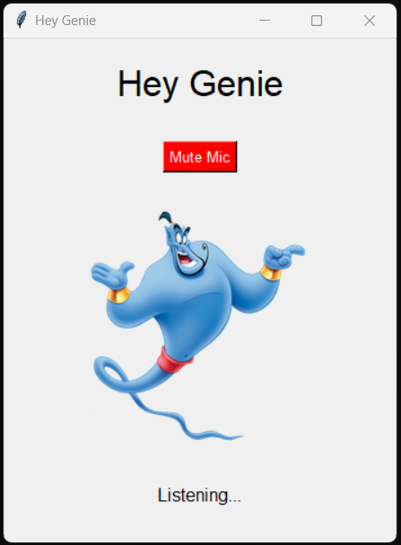

# Genie-VoiceGPT with Groq and Llama 3.1
Setup this voice enabled interactive GPT for kids using free Groq API and Llama 3.1 LLM.

## Create Your Free Groq API Key

Groq Provides a free API with a daily token limits for the LLMs. You can login to https://console.groq.com and create your own API key.

## Pre-requisites

Make sure you have he following:

1. Python is installed in your laptop
2. Groq API Key you have created above

## Setup Steps

1. Download / clone the repo

```git
git clone https://github.com/diy-ai-labs/genie-voicegpt.git -b llm/groq-llama3
```

2. Open main.py and add your own Grow API Key you have in line #20


3. Open command prompt and enter following commands one by one.

```
cd genie-voicegpt
python -m venv venv
venv\Scripts\activate.bat
pip install -r requirements.txt
```


4. Run the below command to start the app.

```
python main.py
```

## A Tip

Try to talk to Genie in more than one word, so that it can recognize better. Avoid single word responses such as yes, no, correct, etc. Try to build a conversation. 

## Let your kids have fun talking to the Genie



