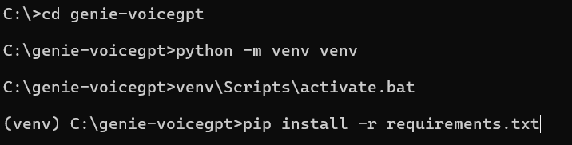

# Genie-VoiceGPT
Voice enabled interactive GPT for kids

## Pre-requisites

Make sure you have he following:

1. Python is installed in your laptop
2. You have the OpenAI API Key

## Setup Steps

1. Download / clone the repo

```git
git clone https://github.com/diy-ai-labs/genie-voicegpt.git
```

2. Open main.py and add the OpenAI API Key you have in line #20


3. Open command prompt and enter following commands one by one.

```
cd genie-voicegpt
python -m venv venv
venv\Scripts\activate.bat
pip install -r requirements.txt
```



4. Run the below command to start the app.

```
python main.py
```

## Let your kids have fun talking to the Genie


